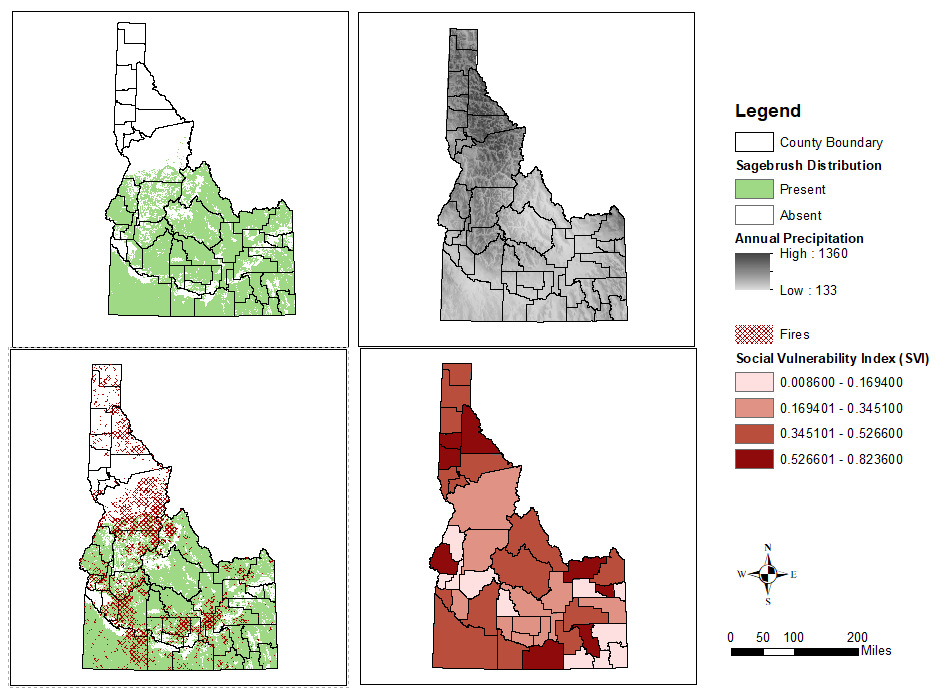
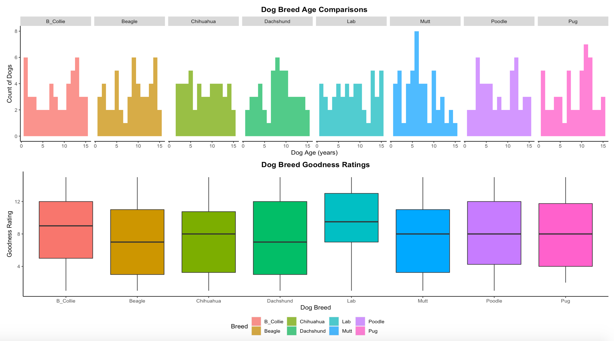

```{r setup, include=FALSE}
knitr::opts_chunk$set(echo = TRUE)
```

```{r packages, echo=FALSE, warning=FALSE, include=FALSE}
#everyone can add in the packages that they will need. 
library(knitr) #knitting tools
library(datasets) #to access base datasets - there's a lot to choose from in here!
library(readr) #to load other data files (e.g., .csv)
library(ggplot2) #to do some fancier plotting
library(ggplotgui) #to access a shiny app for ggplots
library(gridExtra) #to arrange multiple plots on a page
library(grid) #another way to arrange multiple plots
library(ggpubr) #great package for making publication ready plots
library(GGally) #contains the ggnet2 function we will use to make networks
library(network) #tools to create and modify network objects
library(sna) #more tools for network analysis 
library(RColorBrewer) #provides color schemes for figures
library(ape)

#Generate BibTex citation file for all R packages used to produce report
knitr::write_bib(.packages(), file = 'packages.bib')
```

# Introduction
In this tutorial, we will cover the basics of making figures in R and provide several examples and exercises to explore a variety of figure types including scatter plots, box plots, histograms, networks, and phylogenetic trees. The tutorial will be taught in two sessions:

* **Session 1:** Introduction, Basic Figure Making, Using 'ggplot2'
* **Session 2:** Specialized Figure Making: Making Networks and Phylogenetic Trees

## Learning outcomes

This tutorial provides students with opportunities to learn procedures to:

- Insert figures into an R Markdown file. 
- Create, customize, and arrange figures in R using the 'ggplot2' package.
- Create and customize network and phylogenetic tree figures.

## Associated Files, Data, and Packages

The files to support this tutorial are deposited in the shared Google Drive at this path: 
  
  + `Reproducible_Science/Bioinformatic_tutorials/Chapter_10`

In addition to the data files stored in this path, this tutorial will also use the *pressure* and *iris* datasets available through R's 'datasets' package. All packages needed to successfully complete this tutorial are listed in the "packages" code chunk in the .Rmd file. 

# Making Figures with Default Graphics and ggplot2
This section will address different ways to make figures in R. Specifically, we will cover:

* Chunk options for figures
* Plotting with R's default graphics
* Introduction to 'ggplot2'
    + Familiarizing ourselves with ggplot's grammar (Example 1)
    + Exploring a few methods for arranging ggplots (Example 2)
* Exercises to create and arrange different types of figures using 'ggplot2' and associated packages

This is not an exhaustive tutorial for all of the features of 'ggplot2' or R's default graphics, but instead serves as a base to get you started with visualizing your data in more meaningful ways using R!

## Chunk Options for Figures
Gandrud outlines several useful chunk options for figures in R Markdown documents: 

* **fig.path:** This tells knitr where to save your figures by specifying a file path.
* **out.height and out.width:** These set your figure's output height and width. R Markdown uses pixels (ex. To set height to 200 pixels, use out.height='200px'). If you are using LaTeX, you can also specify the height or width using cm, in, or as a proportion of a page element (ex. To set width to 80% of the text width, use outwidth='0.8\\textwidth').
* **fig.align:** This sets the alignment of your figure to left, center, or right.
* **fig.cap and fig.lb:** These set your figure's LaTeX caption and label. 

## Inserting Figures (Review from the Chapter 1)
In Chapter 1, we learned about how to knit figures from images (ex. if you made a figure in a different program or R file), so we will just briefly review that again here. We will use the include_graphics() function of the 'knitr' package to do this. This example shows how to knit some draft ArcGIS maps, we will also specify the fig.cap, fig.align, and out.width. 
```{r Sample Maps, fig.align="center", fig.cap="Example: Inserting ArcGIS Draft Maps", out.width = '100%'}

```
Note: Use 'echo=FALSE' in chunk options to hide your code chunk. The code chunk is included here to demonstrate some of the other chunk options specific to figures.

## Refresher: Plots with R's Default Graphics
Because we already have some experience with Base R's plotting functions, this section serves as a little refresh on how to do some basic plotting before we get into "fancy" plotting with 'ggplot2'. Every time you create a new R Markdown document, you probably have noticed the inclusion of the pressure plot code chunk. That is exactly how to plot in Base R!
```{r Pressure plot example}
#taking a look at what the pressure data is
summary(pressure)

#plotting the pressure data
plot(pressure)
```

Let's try this again with some very unscientific fake data on different dogs' fetch abilities and "goodness" ratings. For now, we will focus on their fetch abilities. Let's start by loading the data file and checking it out.
```{r GoodDogs data, warning=FALSE, message=FALSE}
#load and view data
GoodDogs <- read_csv("GoodDogs.csv")
View(GoodDogs)
```

Now that we can see we have data on both fetch time and fetch distance, let's make a scatter plot, assuming that time is dependent on the distance the ball is thrown (and not on how fast a dog is or its focus on the task at hand).
```{r GoodDogs fetch plot}
plot(GoodDogs$Fetch_Distance, GoodDogs$Fetch_Time)
```

Now that we have the basic scatter plot down, let's clean up our axis labels and add a title. We can do this by specifying the xlab, ylab, and main arguments in the plot() function.
```{r GoodDogs fetch plot 2}
plot(GoodDogs$Fetch_Distance, GoodDogs$Fetch_Time,
     xlab = "Distance Ball is Thrown (ft)",
     ylab = "Fetch Time (s)",
     main = "Throw Distance vs Time while Playing Fetch")
```

## Using ggplot2
### What is ggplot2?
'ggplot2' allows for additional flexibility and customization of our figures. Using the "grammar of graphics", 
'ggplot2' is able to build every graph from the same base components:

* a data set (e.g., your data)
* a set of geoms (e.g., the points representing your data + how you want them to look)
* a coordinate system (e.g., defining where the data points are)

The grammar for this package can feel a little unwieldy at first, so keeping this cheatsheet ([link](https://rstudio.com/wp-content/uploads/2015/03/ggplot2-cheatsheet.pdf)) handy might be helpful!

### Example 1: Revisting Our GoodDogs Data
Let's start to get to know ggplot better by revisiting our fetch data. First, we need to specify our data using ggplot(). Next, we specify that we want a scatter plot using geom_point().
```{r GoodDogs fetch ggplot}
#make a basic scatter plot
ggplot(GoodDogs, aes(x=GoodDogs$Fetch_Distance, y=GoodDogs$Fetch_Time)) +
  geom_point() 
```

Now let's make our figure look a little bit nicer by cleaning up our axis labels. 
```{r GoodDogs fetch ggplot2}
#add axis labels and a title
ggplot(GoodDogs, aes(x=GoodDogs$Fetch_Distance, y=GoodDogs$Fetch_Time)) +
  geom_point() +
  xlab("Distance Ball is Thrown (ft)") + #rename the x axis label
  ylab("Fetch Time (s)") + #rename the y axis label
  ggtitle("Throw Distance vs Time while Playing Fetch") + #add a plot title
  theme(plot.title = element_text(hjust = 0.5))  #this centers our title
```

We also might want to know some more about our data, like which points are associated with the different dog breeds in our dataset. This will use our same code from above, but a color argument to the aes argument of ggplot.
```{r GoodDogs fetch and breed ggplot}
#add color based on dog breed
ggplot(GoodDogs, aes(x=GoodDogs$Fetch_Distance, y=GoodDogs$Fetch_Time, color=GoodDogs$Breed))+   
  geom_point() +
  xlab("Distance Ball is Thrown (ft)") + 
  ylab("Fetch Time (s)") + 
  ggtitle("Throw Distance vs Time while Playing Fetch") + 
  theme(plot.title = element_text(hjust = 0.5)) 
```

Finally, let's refine our legend and title styling a bit more. We can also streamline our labels code using the labs function. Let's also change our plot theme to remove the gridlines and gray background.
```{r GoodDogs pretty fetch and breed ggplot}
ggplot(GoodDogs, aes(x=GoodDogs$Fetch_Distance, y=GoodDogs$Fetch_Time, color=GoodDogs$Breed))+   
  geom_point() +
  labs(color = "Dog Breeds", x="Distance Ball is Thrown (ft)", y="Fetch Time (s)") + #combine our label functions and add in an argument for the legend title
  ggtitle("Throw Distance vs Time while Playing Fetch") + 
  theme(plot.title = element_text(hjust = 0.5, face = "bold"), legend.title = element_text(face = "bold"), legend.title.align = 0.5, panel.background = element_blank(), panel.border = element_blank(), panel.grid.major = element_blank(),
panel.grid.minor = element_blank(), axis.line = element_line(colour = "black")) #specify that the title should be in bold (face), format the legend title (legend.title and legend.title.align), and change the background color and gridlines (panel arguments)
```

### Example 2: Arranging ggplots
Now that we are feeling more comfortable with ggplot's grammar, let's explore some additional customization options using 'ggplot2'. &nbsp;

Let's start by exploring our GoodDogs data using a point and click shiny app available through the 'ggplotgui' package. This is a really nice tool for getting familiar with the 'ggplot2' grammar and for very quickly visualizing our data. We will use this to create a very simple histogram to see the age distribution of the dogs in our dataset.
```{r Shiny app for ggplot visualization}
#ggplotgui::ggplot_shiny(GoodDogs) #this opens a shiny app to point and click make a ggplot; note: commented out for tutorial - Haley will demonstrate this for the class
```

We can copy the code that the ggplot GUI app uses to produce this histogram as a shortcut. I also copied the code for age histograms by breed and goodness rating boxplots by breed. Because the app is limited in features, we will work on customizing these figures more next in Exercise 1A. But first, let's start by running this code chunk and see the base ggplots we have produced. Ggplots can be saved as objects, which is a helpful feature.
```{r Code from GUI}
#copied from the ggplot GUI app, changed df to GoodDogs and saved as object 
DogAge <- ggplot(GoodDogs, aes(x = Age)) +
  geom_histogram(position = 'identity', alpha = 0.83, binwidth = 1) +
  labs(x = 'Age', y = 'Count') +
  ggtitle('Dog Ages') +
  theme_classic()
DogAge

#copied from the ggplot GUI app, changed df to GoodDogs and saved as object; note: this is an example of faceting
DogAgeBreed <- ggplot(GoodDogs, aes(x = Age)) +
  geom_histogram(position = 'identity', alpha = 0.8, binwidth = 1) +
  facet_grid( . ~ Breed ) +
  labs(x = 'Dog Age (years)', y = 'Count of Dogs') +
  ggtitle('Dog Breed Age Comparisons') +
  theme_classic()
DogAgeBreed

#copied ratings boxplot, changed df to GoodDogs and saved as object
DogRating <- ggplot(GoodDogs, aes(x = Breed, y = Rating)) +
  geom_boxplot(notch = FALSE) +
  labs(x = 'Dog Breed', y = 'Goodness Rating') +
  ggtitle('Dog Breed Goodness Ratings') +
  theme_classic()
DogRating
```

Before we get to our first Exercise to start practicing making and arranging ggplots, let's first go over how to arrange multiple ggplots on a page. We can use the plots we just made as an example. Faceting, like we see in the DogAgeBreed plot, is one way to achieve this. &nbsp;

**Method 1:** 'gridExtra' package and grid.arrange() function &nbsp;

The grid.arrange() function of the 'gridExtra' package is another easy option for arranging multiple plots. We have already saved our ggplots as objects, which is the first step in arranging them.
```{r Arrange Dog Plots}
grid.arrange(DogAgeBreed, DogRating, nrow=1) #nrow=1 is specifying we want them in a single row
```

But uh oh! That's difficult to read. Let's try arranging them in two rows.
```{r Arrange Dog Plots Rows}
grid.arrange(DogAgeBreed, DogRating, nrow=2) #trying two rows
```

You can also arrange the plots by specifying columns. Let's add in our DogAge histogram to illustrate this.
```{r Arrange Dog Plots Rows and Columns}
#two rows, two columns
grid.arrange(DogAge, DogAgeBreed, DogRating, nrow=2, ncol=2) 
```

**Method 2:** 'grid' package &nbsp;

The 'grid' package also allows for arranging plots and can be useful for more complicated arrangements. This can help use span over multiple columns or rows. Let's see an example here.
```{r Arrange with Grid}
# Move to a new page
grid.newpage()
# Create layout : nrow = 3, ncol = 2
pushViewport(viewport(layout = grid.layout(nrow = 3, ncol = 2)))
# A helper function to define a region on the layout
define_region <- function(row, col){
  viewport(layout.pos.row = row, layout.pos.col = col)
} 
# Arrange the plots
print(DogAgeBreed, vp = define_region(row = 1, col = 1:2))   # Span over two columns
print(DogAge, vp = define_region(row = 2, col = 1))
print(DogRating, vp = define_region(row = 3, col = 1:2))
```

**Method 3:** 'ggpubr' package and the ggarrange() function
```{r ggpubr Arrangements}
ggarrange(DogAgeBreed,                  # First row with breed/age histogram
          ggarrange(DogAge, ncol = 2), # Second row with age histogram
          ggarrange(DogRating, ncol = 1), #Third row with rating box plots
          nrow = 3)                                   
```

## Exercise 1A: Customizing the DogAgeBreed and DogRating ggplots
Because there is likely a range of ggplot experience in this group, think of these exercises like a choose your own adventure. If you want to play around with 'ggplot2' and do your own thing with the plots, feel free to do so! Otherwise, you can work to produce something like this:
```{r Exercise1A Figures, echo=FALSE, fig.align="center", fig.cap="Exercise 1A Sample Figures", out.width = '100%'}

```
**Steps:**

1. Create a histogram of dog ages faceted and colored based on dog breed. This histogram should have no background, panels, or gridlines. Add a title and axis labels.
    + Save the histogram as an object once you are happy with its format.
2. Create a boxplot (x = Breed, y = Rating) and color it based on dog breed. This boxplot should have no background, panels, or gridlines. Add a title and axis labels.
    + Save the boxplot as an object once you are happy with its format.
3. Use ggarrange() or another method to format your two plots into a two row arrangement with a common legend.

If you get stuck, my solution is available in the .Rmd file (Chunk: Solution1A)!
```{r Solution1A, echo=FALSE, eval=FALSE}
DogAgeBreed1A <- ggplot(GoodDogs, aes(x = Age, fill = Breed)) +
  geom_histogram(position = 'identity', alpha = 0.8, binwidth = 1) +
  facet_grid( . ~ Breed ) +
  labs(x = 'Dog Age (years)', y = 'Count of Dogs') +
  theme(plot.title = element_text(hjust = 0.5, face = "bold"), panel.background = element_blank(), panel.border = element_blank(), panel.grid.major = element_blank(),panel.grid.minor = element_blank(), axis.line = element_line(colour = "black")) +
  ggtitle('Dog Breed Age Comparisons') 

DogRating1A <- ggplot(GoodDogs, aes(x = Breed, y = Rating, fill = Breed)) +
  geom_boxplot(notch = FALSE) +
  labs(x = 'Dog Breed', y = 'Goodness Rating') +
  theme(plot.title = element_text(hjust = 0.5, face = "bold"), legend.title = element_blank(), legend.position = "none", panel.background = element_blank(), panel.border = element_blank(), panel.grid.major = element_blank(),
panel.grid.minor = element_blank(), axis.line = element_line(colour = "black")) +
  ggtitle('Dog Breed Goodness Ratings')

ggarrange(DogAgeBreed1A, 
          ggarrange(DogRating1A, ncol = 1), 
          nrow = 2, common.legend = TRUE, legend = "bottom") 
```

## Exercise 1B: Revisiting the Iris Data from Chapter 8!
We will use the iris dataset that we first saw in the Chapter 8 tutorial to work on some more complex arrangement and figure customization. We will use the steps below to produce this:
```{r Exercise1B Figures, echo=FALSE, fig.align="center", fig.cap="Exercise 1B Sample Figures", out.width = '100%'}
knitr::include_graphics("solution1B.png")
```
Our end result is by no means complete, but will give you some practice for making different plot types and getting used to using these different packages. Feel free to edit axis labels, titles, and more! &nbsp;

**Steps:**

1. Create the following plots using the iris dataset and 'ggplot2' (challenge: use the 'ggpubr' package to create the plots - see link below):
    + A box plot of the Sepal.Width data
    + A faceted scatter plot with trend lines of y = “Petal.Length” by x = “Petal.Width"
    + A jittered violin plot of Petal.Length by species
2. Create an "all.sepals" ggplot object where x = "Sepal.Length", y = "Sepal.Width"
3. Use the "all.sepals" object to create a scatter and 2D density plot.
4. Use the minimal theme for all plots.
5. Arrange the plots from steps 1-3 in 3 rows and with a common legend for iris species. Try specifying column widths to help with crowding in the resulting arrangement.

If you get stuck, my solution is available in the .Rmd file (Chunk: Solution1B)!
```{r Solution1B, echo=FALSE, eval=FALSE}
#refresh on the variables in the iris dataset
summary(iris)

#box plot for sepal.width
SepalBox <- ggplot(iris) + 
  geom_boxplot(aes(x = Species, y = Sepal.Width, color = Species)) +
  theme_minimal()

#scatter plots with trend lines and faceting
PetalScatter <- ggplot(data=iris,aes(x=Petal.Width, y=Petal.Length,color=Species)) +
  geom_point() +
  geom_smooth(se=FALSE) +
  facet_wrap(~Species,scale='free_y') +
  theme_minimal()

#layered violin plot (violin + jitter)
p <- ggplot(iris, mapping = aes(x = Species, y = Petal.Length, color = Species))
violin.layer <- geom_violin() 
jitter.layer <- geom_jitter(width=0.15, height=0.05, alpha=0.5, size=0.75) 

PetalViolin <- p + violin.layer + jitter.layer + theme_minimal() #combine layers of plot

#create an all.sepals object
all.sepals <- ggplot(iris, aes(x = Sepal.Length, y = Sepal.Width))

#use the all.sepals object to create a scatter plot and density plot
SepalScatter <- all.sepals + 
  geom_point(aes(color = Species, shape = Species), size = 2, alpha = 0.6) +
  theme_minimal()

SepalDensity <- all.sepals + 
  geom_density_2d(aes(color = Species), alpha = 0.5) + 
  geom_point(aes(color = Species), alpha=0.5, size=1) + 
  facet_wrap(~ Species) +
  theme_minimal()

#arrange plots with a common legend
ggarrange(PetalScatter, PetalViolin, SepalScatter, SepalBox, SepalDensity, ncol=2, nrow=3, widths = c(1, .75), common.legend = TRUE, legend="bottom")
```

## Challenge/Next Steps
To explore 'ggpubr', 'gridExtra', 'ggplot2', and other packages more, check out this great tutorial from STHDA ([link](http://www.sthda.com/english/articles/24-ggpubr-publication-ready-plots/81-ggplot2-easy-way-to-mix-multiple-graphs-on-the-same-page/#use-common-legend-for-combined-ggplots)). This tutorial goes into even more ways to arrange and visualize plots to get your figures publication-ready!

# Exercise 2: Networks

## What is a network?
 At its core, a network is simply a set of vertices connected by a set of edges. There are many kinds of networks, and network analyses can be used across disciplines. For instance, networks of scientific collaboration, a food web of marine animals, and American college football games are all covered in a paper on community detection in networks by Girvan and Newman (2002). Additionally, Buldyrev et al. (2010) study node failure in interdependent networks like power grids. Social networks such as links between television and film actors found on http://www.imdb.com/ and neural networks, like the completely mapped neural network of the C. elegans worm are also extensively studied (Watts and Strogatz, 1998).

## Network terminology

In network analyses, "nodes" designate the vertices of a network whereas "edges" indicate the ties between nodes. The edges in networks can be *directed*, indicating an ordering of vertices (wherein switching the direction of hte edge would change the structure of the network), or the edges can be *undirected*, meaning the edges are simply connections between vertices where order does not matter. 

*  The **World Wide Web**  is an example of directed edges: hyperlinnks connect one Web apge to another, but not necessraily the other way around!
* **Co-authorship networks** are eamples of undirected networks, wherein nodes are authors and are connected by an edge if they have written a publication together (direction does not matter!)

## Visualizing a network diagram in R using ggnet2

To continue  our understanding of ggplot2, we will be using the ggnet2 function, which offers a larger range of network visualization in a single function call. ggnet2 plots network objects as ggplot2 objects that can be styled using ggplot2 scales and themes. While the ggnet2 function uses a syntax that may be familiar to those who have worked with ggplot2, it is also designed to be easily understood by users who may not be familiar with ggplot2 obkects. Thus, while ggnet2 applies the "grammar of graphics" to  network objects, the funciton itself works very much like the plotting functions of the igraph and/or network packages in that a long series of arguments is used to control p[retty much every aspect of the network visualization. ggnet2 is available through the GGally package.

## Let's create a basic network!

For the purpose of this tutorial, we are going to create an undirected basic network, with 10 nodes named "a, b, ..., i, j" and a high likelihood of an edge to exist between them:

```{r network, echo = TRUE, eval = TRUE}
# random graph
net = rgraph(10, mode = "graph", tprob = 0.5)
net = network(net, directed = FALSE)

#vertex names
network.vertex.names(net) = letters[1:10]

#visualize the network
ggnet2(net)
```

The net argument is the only compulsory argument of ggnet2. It can be a network object or any object that can be coerced to that class through its edgeset.constructors functions, such as adjacency matrixes, incidence matrixes and edge lists.

## Let's start to modify our network!

The most basic properties of our network that we might want to change are the size/color of the nodes and/or the size/color of the edges. Let's practice modifying each of these properties...

```{r netproperties, echo = TRUE, eval = TRUE}
# editing node and edge properties
ggnet2 (net, node.size = 6, node.color = "black", edge.size = 1, edge.color = "grey")
```

Note that the vertex-related arguments of ggnet2 start with node, and the edge-related arguments start with edge. We can also abbreviate the node.color and node.size arguments to save time!

```{r netproperties2, echo = TRUE, eval = TRUE}
ggnet2(net, size = 6, color = "black", edge.size = 1, edge.color = "grey")
```

Using these basic methods, we can set the color, size, shape, and even transparency of the nodes. Let's practice! Using the code chunks above as an example, modify your network so that it contains:

* grey nodes
* red edges
* try different versions with small vs. big nodes and thin vs. thick edges

## Node placement

In addition to the attributes modified above, we can also modify the POSITION of our nodes. By default, ggnet2 places nodes using something called the Fruchter-Reingold force-directed algorithm. However, there are other algorithms we might want to use instead. There is no single, "good" layout algorithm, and different approaches may be valuable under different circumstances.For more information, you can see the documentation of the gplot.layout function for the lsit of placement algorithms. Let's test out a few different common algorithms. How do these networks differ from one another?

```{r nodeplace, echo = TRUE, eval = TRUE}
# algorithms of node placement
ggnet2(net)
ggnet2(net, mode = "circle")
ggnet2(net, mode = "kamadakawai")
ggnet2(net, mode = "random")
```

As noted, the default is Fruchterman-Reingold. This function generates a layout using a variant of Frucherterman and Reingold's force-directed placement algorithm. The circle algorithm places vertices uniformly in a circle and can't be modified by any additional arguments. The kamadakawai funciton generates a verte layout using a version of the Kamada-Kawi force-directed placement algorithm. As one might epect, the  random funciton places vertices randomly - you can re-run this line of code repeatedly and see all the different node arrangements that are randomly generated! 

### Let's practice!

Open up the help documentation for the gplot.layout function and look at the list of possible layouts. Choose one we haven't looked at yet and edit your network code to reflect a different mode. How did your function alter the arrangement of the network from the default settings?

## Advanced node colors

We have already considered how to do a basic modification of node colors. Let's now assign a vertex attribute "phono", which indicates whether the name of the vertex is a vowel or consonant. This attribute can be passed to ggnet2 to indicate that the nods belong to a group. We will pass the name of the verte attribute to the color argument, which will then use it to map the colors of the nodes.

```{r nodecolor, echo = TRUE, eval = TRUE}
# indicating vowel or consonant
net %v% "phono" = ifelse(letters[1:10] %in% c("a", "e", "i"), "vowel", "consonant")

# map node color based on vertex attribute
ggnet2(net, color = "phono")
```

By default, ggnet2 assigns a grayscale color to each group, but we can modify this behavior! There are different options to modify the color assignment. Let's try out a few options! One method consists of "hard-coding" the colors into the graph by assigning them to a vertex attribute, and then passing this attribute to ggnet2:

```{r colorassign, echo = TRUE, eval = TRUE}
# hard-coding the color assignments
net %v% "color" = ifelse(net %v% "phono" == "vowel", "steelblue", "tomato")
ggnet2(net, color = "color")
```

We could also create a named vector consisting of a color legend through the palette argument, or generate a color vector "on the fly" directly in the function call (a more condensed version of the first option):

```{r colorassign2, echo = TRUE, eval = TRUE}
#color legend as a named vector using the palette argument
ggnet2(net, color = "phono", palette = c("vowel" = "steelblue", "consonant" = "tomato"))

# generate color vector on the fly
ggnet2(net, color = ifelse(net %v% "phono" == "vowel", "steelblue", "tomato"))
```

Lastly, we can also use pre-defined color palettes using the RColorBrewer package. Palette ferers to the name of any ColorBrewer palette, so ggnet2 will use this argument to color the nodes. If it returns an error message, there may not be enough colors in the package to encompass all node types.

```{r colorpalette, echo = TRUE, eval = TRUE}
# using pre-defined color palettes
ggnet2(net, color = "phono", palette = "Set2")
```

## Node sizes

Now let's start to think about the size of our nodes! In network analyses, it is common to size the nodes by their centrality or some other element of interst. Just like the color argument, the size argument of ggnet2 can take a single numeric value, a vector of values, or a  vertex attribute:

```{r nodesize, echo = TRUE, eval = TRUE}
# changing node size with a vertex attribute
ggnet2(net, size = "phono")
```

Just like how we could use palettes to change the color of the nodes, we can also use the argument size.palette to create nodes of different sizes that are more easy to distinguish visually:

```{r sizepal, echo = TRUE, eval = TRUE}
# using size.palette
ggnet2(net, size = "phono", size.palette = c("vowel" = 10, "consonant" = 1))
```

We can also modify the nodes so that their size corresponds to their centrality, or number of connections, within the network. We can define two separate measures of degree centrality: indegree, whic his the count of the number of ties directed to the node, and outdegree, which is  the number of ties the node directs to others. 

When ties are associated to some positive aspects such as friendship or collaboration, indegree is often interpreted as a form of popularity, and outdegree as gregariousness. ggnet2 also recognizes total (or Freeman) degree, which can also be thought of as "betweenness" or a node acting as a bridge along the shortest path betwen two other nodes. In addition to "indegree", "outdegree", and "freeman", ggnet also understands the argument "degree" which is equivalent to freeman. 

```{r degrees, echo = TRUE, eval = TRUE}
ggnet2(net, size = "degree")
```

### Let's practice!

Change your network to reflect either "indegree" or "outdegree." Did it make a noticeable difference in your network  visualization? Why or why not?

## Changing node shapes and transparency

You may have already realized that circles are the default node shape for ggnet2, but they are not the only option! We can also modify the shape and transpacery of the nodes in the same manner that we modified the color and size of the nods, either through a single value, a vector of values, or a vertex attribute! 

```{r shapes, echo = TRUE, eval = TRUE}
# changing shape using a single value
ggnet2(net, color = "phono", shape = 15)

# changing shape using a vertex attribute
ggnet2(net, color = "phono", shape = "phono")
```

Note: the second example above will return a warning about a duplicated plotting parameter. This is an innocuous warning that is produced by mapping two characteristics of the nodes to the same vertex attribute. It cannot be avoided without modifying ggplot2.

Again, just like the color and size, we can use the alpha and shape arguments to take manual "palettes" of values through the alpha.palette and shape.palette arguments.

```{r shapepalette, echo = TRUE, eval = TRUE}
# using palettes to change transparency of nodes
ggnet2(net, alpha = "phono", alpha.palette = c("vowel" = 0.2, "consonant" = 1))

# using palettes to change the shape of the nodes
ggnet2(net, shape = "phono", shape.palette = c("vowel" = 19, "consonant" = 15))
```

### Challenge!

Recall that we used "palettes"  to specify which colors we wanted our consonant and vowel nodes to display as. Can we use the palette argument to do the same thing with shapes (e.g. manually specify which shape we want consonants vs. vowels to appear as)? Let's try it out!

```{r solution, echo = FALSE, eval = FALSE}
# solution 

```

When it comes to making these customizations, it is important to consider what you are trying to communicate with your network. ggnet2 is pretty fleible with changing node shapes and transparency, which can make it easy to go overboard. Try and make the minimal amount of modifications that communicate what is important in your network - node shapes become difficult to distinguish if you use more than six different shapes in the plots, and transparencies may not be as easily distinguishable by the reader. 

```{r examples, echo = TRUE, eval = TRUE}
# example of overly modified node shapes
ggnet2(net, shape = sample(1:10))

#example of nodes of different transparencies 
ggnet2(net, alpha = "phono")
```

## Labeling our nodes

Through the label argument, we can also use ggnet2 to label the nodes of a network using vertex names, another vertex attribute, or any other vector of labels:

```{r labels, echo = TRUE, eval = TRUE}
# labeling using vertex names
ggnet2(net, label = TRUE)

# labeling using vertex attribute
ggnet2(net, label = "phono")

#labeling using vector of labels
ggnet2(net, label = 1:10)
```

We can also choose WHICH nodes we want to label. Recall that this network is based on a string of letters, so we can choose to label nodes based on if they are a consonant or a vowel:

```{r vectorlabel, echo = TRUE, eval = TRUE}
# labeling only vowels using a vector of values
ggnet2(net, label = c("a", "e", "i"), color = "phono", label.color = "black")
```

ggnet2 automatically sets the size of the labels to be half that of the node size, but we can also control the size of the label using the label.size argument, their color using the label.color argument, and their level of transparency using the label.alpha argumment:

```{r labeledit, echo = TRUE, eval = TRUE}
# changing label size
ggnet2(net, size = 12, label = TRUE, label.size = 5)

#changing label color
ggnet2(net, size = 12, label = TRUE, color = "black", label.color = "white")

# changing label transparency
ggnet2(net, label = TRUE, label.alpha = 0.75)
```

### Let's try practicing on our own!

Using the code above as an example, modify your network so that the labels are 1/4 as big as the node size, the nodes are tomato-colored with steel blue labels, and 50% transparency!

```{r solution2, echo = FALSE, eval = FALSE}
# solution

```

## More fun with networks!

There are LOT more things you can do with networks than there is time to go over in this tutorial. Some examples of other ways we could have modified our network using ggnet2 include...
- altering the node legends using the alpha.legend, color.legend, shape.legend, and size.legend arguments
- changing the line type of the edges
- adding arrows to our edges to indicate directionality 
- coloring edges based on the attributes of connected nodes
- removing nodes based on missing values

Furthermore, ggnet2 is just ONE package we can use to visualize networks. Other common packages to visualize networks include *igraph* and *networkD3*. 

* **igraph** is useful for building a network diagram from adjacency matrix, edge list, literal list of connections, and more. 
* **networkD3** allows users to build **interactive** network diagrams with R, including zoom, hover nodes, reorganize the layout. This package will provide features for dynamic data manipulation and visualization and allows users to become active participants in data visualization process by allowing users to explore data points, hierarchies among the data, filter data by groups, and more

# Exercise 3: Visualizing phylogenetic trees in R

## What is a phylogeny? 
A phylogenetic tree is a diagram that represents evolutionary relationships among organisms. Phylogenetic trees are hypotheses, not definitive facts, based on collected information about a set of species, eg. morphology or DNA.

## Formats used in this tutorial
* **FASTA:** FASTA format is a text-based format for representing either nucleotide sequences or peptide sequences, in which base pairs or amino acids are represented using single-letter codes. A sequence in FASTA format begins with a single-line description, followed by lines of sequence data.
* **NEWICK:** Newick format is a commonly used way of representing tree topologies as text. Put simply, monophyletic clades are surrounded by parentheses and sister clades are separated by commas. For example, a simple tree could be written as (((A,B),C),(D,E)). Newick format also contains information about branch lengths (after colons) and node names (after closed parentheses).

### Creating trees from DNA seqs using the package ape
```{r ape_tree, include=TRUE}
#set your working directory to the "phylogenies" directory 
#setwd("~/EEB_Program/Courses/Reproducible_Science/Chapter_10/phylogenies")

#install the package ape if you have not already 
#install.packages("ape")
library(ape)

#read the aligned DNA sequences which are in FASTA format
dna <- read.dna(file = "vanilla_seqs_specs.fasta", format = "fasta")

#calculate pairwise genetic distances
#What is the defaultevolutionary model used to calcualte distances?
D <- dist.dna(dna)

#make a neighbor joining tree
#What class is this tree?
tree <- nj(D)
class(tree)

#plot the tree
plot(tree, cex = 0.6, main = "Unrooted NJ Tree")
```

```{r rooted tree, include = TRUE}
#make a rooted tree
tree2 <- root(tree, outgroup = "MK201723.1 Vanilla mexicana")
plot(tree2, main = "Rooted NJ Tree", cex = .7)
```

### Reading Newick files and visualizing trees
```{r newick files, include = TRUE, results = 'hide'}
#use the read.tree function to open newick files. Check out their structure and class. 
tree <- read.tree("Theobroma_tree.nwk")
str(tree)
class(tree)

#check out the arguments that can be used to plot trees
?plot.phylo()

#plot the tree and play around with different arguments
plot(tree,no.margin=TRUE,edge.width=2)
```

# Resources

- Chapter 10 of Gandrund(2015)
- Chapter 1 of Wickham and Grolemund (2017)
- Chapter 22 of Guangchuang et al. (2017)
- ggplot2 and Beyond Tutorials
  - https://bio304-class.github.io/bio304-book/introduction-to-ggplot2.html
  - http://www.sthda.com/english/articles/24-ggpubr-publication-ready-plots/81-ggplot2-easy-way-to-mix-multiple-graphs-on-the-same-page/#mix-table-text-and-ggplot
  

# References

<div id="refs"></div>

# (APPENDIX) Appendix {-}

# Appendix 1

Citations of all R packages used to generate this report. 

```{r generateBibliography, results="asis", echo=TRUE, warning = FALSE, message=FALSE}
library("knitcitations")
cleanbib()
options("citation_format" = "pandoc")
read.bibtex(file = "packages.bib")
``` 

# Appendix 2

Version information about R, the operating system (OS) and attached or R loaded packages. This appendix was generated using `sessionInfo()`.

```{r eval=T, echo=F, warning = FALSE, message=FALSE}
sessionInfo()
```

